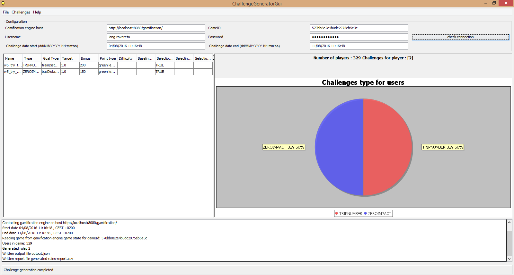

# Challenge generation gui

A simple gui (graphical user interface) for gamification engine challenge generation

## Description

Challenge generator GUI is a Swing based Graphical User Interface for [https://github.com/das-fbk/game-engine.challenge-gen](Gamification engine challenge generator)

## Prerequisites 

* Java 1.7 or higher
* Maven 3.2 or higher
* Gamification engine, [setup guide here](https://github.com/smartcommunitylab/smartcampus.gamification/wiki/Setup) version [2.0.0](https://github.com/smartcommunitylab/smartcampus.gamification/tree/r2.0.0)

## How to build

1. Clone repository with git
2. Compile with maven using mvn install

# Thanks to

Jojo Mendoza per icon - https://www.iconfinder.com/icons/1218802/alert_bulb_create_idea_on_think_icon#size=128

## License

Project is licensed under the Apache License Version 2.0