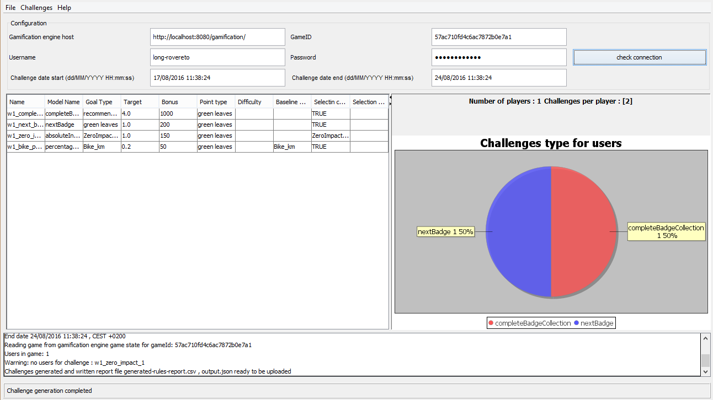

# Challenge generation gui

A simple gui (graphical user interface) for gamification engine challenge generation from [DAS](https://github.com/das-fbk)

## Description

Challenge generator GUI is a Swing based Graphical User Interface for [Gamification engine challenge generator](https://github.com/das-fbk/game-engine.challenge-gen)

## Prerequisites 

* Java 1.7 or higher
* Maven 3.2 or higher
* Gamification engine, [setup guide here](https://github.com/smartcommunitylab/smartcampus.gamification/wiki/Setup) version [2.1.0](https://github.com/smartcommunitylab/smartcampus.gamification/tree/r2.1.0)
* Gamification engine challenge generator, [see here](https://github.com/das-fbk/game-engine.challenge-gen/tree/long-game-trento)

## How to build

1. setup prerequisites
2. Clone repository with git
3. Compile with maven using mvn clean install -Pgui

## How to configure

1. Open test.properties file and configure gamification engine connection settings: GAMEID, HOST and optionally configure filtering properties FILTERING_ENABLED, FILTERING
2. configure logs using log4j2.xml

## How to use

Launch using:
 
* directly from your IDE ChallengeGeneratorGui.java 
* unzip assembly target/challengeGenerator-gui.zip and launch challengeGenerator.jar using java -jar challengeGenerator.jar or double clickin on it 

# Thanks to

Jojo Mendoza per icon - https://www.iconfinder.com/icons/1218802/alert_bulb_create_idea_on_think_icon#size=128

## License

Project is licensed under the Apache License Version 2.0